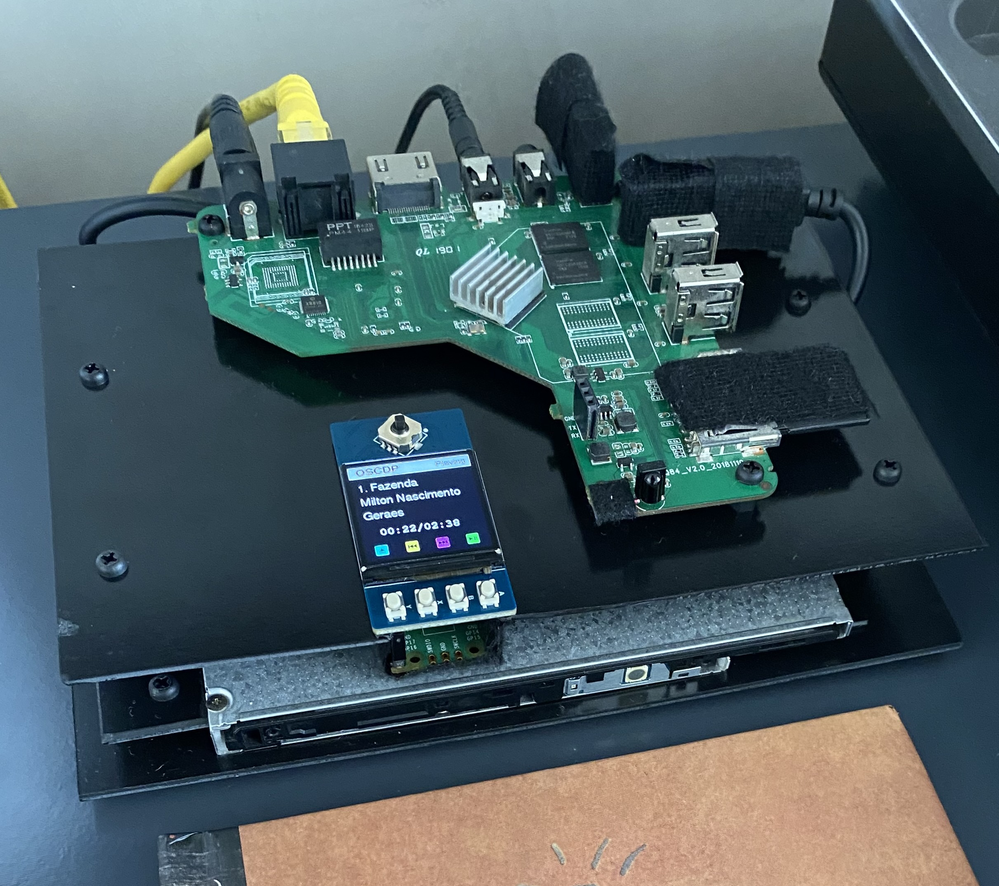

# OSCDP
Open Source CD Player/Transport running Linux

## Player requirements
- Linux 
    - mpv + alsa[pulseaudio might work too]
    - go
- CD/DVD drive; USB, SATA, or IDE
  - Only need to adjust the CDDEVICE variable on discid.go
- Network connection (Optional)
    - To retrieve information about the CD from MusicBrainz
    - To control the player remotely

## Controller requirements
- Raspberry Pi Pico
- [WaveShare 1.3inch HAT](https://www.waveshare.com/pico-lcd-1.3.htm)
